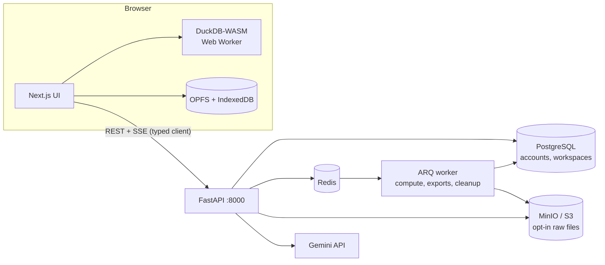

# In-Browser Data Workbench

A privacy-first data workbench that runs in the browser. Drop in a CSV, Excel,
Parquet or JSON file and query it with SQL — every byte is parsed and executed
locally by DuckDB-WASM. A FastAPI backend adds accounts, saved workspaces,
sharing and an AI layer, but the raw data never has to leave the machine.

- **Frontend** — [`apps/web`](apps/web/README.md) · Next.js 15 + DuckDB-WASM
- **Backend + AI** — [`apps/api`](apps/api/README.md) · FastAPI + Postgres + Redis
- **Phase plans** — [`plan/`](plan/overview.md)

---

## 1. What this project is

A local-first workbench for tabular data. You open the page, drag in a file, and
within a second you're writing SQL against it — no upload, no account, no
network request after the page loads. From there results become charts, charts
become dashboards, and the whole workspace exports as a small JSON file you can
hand to a colleague.

The backend is deliberately a *second* thing. Everything above works with the
API switched off entirely. What the API adds is the stuff that genuinely needs a
server: accounts, workspaces that follow you between machines, share links, an
opt-in raw-file store, a server-side compute fallback for files bigger than
browser memory, and the AI endpoints (which live server-side so the Gemini
key never reaches the browser).

**Current state:** frontend and backend are wired together — sign-in, cloud
workspaces, share links and the AI features all work. See
[§5](#5-project-status-read-this-first) for exactly what is and isn't built.

## 2. What problem it solves

The user is anyone handed a file too big for Excel and too small to justify a
warehouse: analysts, ops teams, engineers doing a sanity check, journalists with
a FOIA dump, anyone debugging an export.

| The pain | Why the usual answer fails |
|---|---|
| Excel dies around a million rows | Not a tooling preference — a hard ceiling |
| Hosted SaaS tools want an upload | Uploading company data is a compliance conversation, not a click |
| "Just write a pandas script" | Not an option for non-engineers, and overkill for one question |

**The differentiator is that client-side execution is the value proposition, not
a technical flourish.** Because the file never leaves the machine there is no
data-governance discussion to have, and the app works offline by construction
rather than as a bolted-on feature. This is the rare project where the
interesting engineering and the believable customer story are the *same claim*.

## 3. How we tackle it

### The core bet: the browser is the compute engine

DuckDB-WASM runs the queries, in a Web Worker, over files registered directly
into its virtual filesystem. The server stores *metadata and artifacts* —
workspace definitions, saved queries, chart specs — never the user's rows,
unless the user explicitly opts into cloud storage or server compute.

That single decision is what forces the rest of the design, because there is no
server to offload to. Every problem that would have been a backend problem
becomes a browser problem, under constraints server code doesn't have: one main
thread that must stay responsive, a memory ceiling you cannot raise by
provisioning, and a tab that gets *killed* rather than restarted.

### The principles that fall out of it

**Nothing large crosses into JavaScript.** Grid paging is `LIMIT`/`OFFSET` in
SQL. Charts hold a *query*, not data, so a chart over 10M rows costs what one
over a thousand costs. Exports go through DuckDB's own `COPY … TO` so rows never
pass through JS and aren't capped by what the grid is showing.

**Specs, not data, are what we persist.** A dashboard stores chart specs, so
re-importing a newer file updates it for free. The `.dwb.json` workspace export
contains queries, charts and dataset *metadata* but no rows — which keeps it a
4 KB artifact and means emailing it can't quietly undo the privacy promise.

**Generated SQL is a proposal, and you see it first.** Both the no-code
transform builders and the AI endpoints compile down to SQL that is shown before
it runs. Compilation is one-directional on purpose — there is no SQL→spec
parser — so the generated SQL stays the source of truth and stays freely
editable once it lands in the editor.

**Degrade, don't throw.** OPFS and IndexedDB fall back to no-ops on browsers
that lack them; losing session restore beats refusing to import a file. An
unreachable Redis degrades the API to in-process jobs, which `/readyz` reports
honestly as `inline_fallback`. A failed DuckDB extension mirror falls back to a
CDN autoload.

**Two SQL gates, for two different threat models.** [`ai/validator.py`](apps/api/src/app/ai/validator.py)
filters model-generated SQL that the *browser* will run, so a miss costs
quality. [`compute/sql_guard.py`](apps/api/src/app/compute/sql_guard.py) filters
SQL that runs on *our* hardware against other tenants' storage credentials, so a
miss is a breach — it uses an allowlist where every `FROM` source must be a
dataset bound into the session, with `enable_external_access` off underneath as
defense in depth.

## 4. Tech stack and wiring

### Stack

| Layer | Technology |
|---|---|
| Frontend | Next.js 15 (App Router), TypeScript strict, Tailwind v4, Zustand |
| Engine | DuckDB-WASM in a Web Worker, Apache Arrow transport |
| UI | TanStack Table + Virtual (grid), Monaco (editor), ECharts (charts) |
| Browser storage | OPFS (imported files), IndexedDB (history, snippets, dashboards) |
| Backend | FastAPI, Python 3.12, SQLAlchemy 2 + Alembic, Pydantic v2 |
| Data | PostgreSQL 16, Redis 7, S3-compatible object storage (MinIO in dev) |
| Jobs | ARQ worker on Redis, SSE progress streams |
| AI | Google Gemini via the backend, streamed over SSE |
| Infra | Docker Compose, uv (Python), pnpm (Node), GitHub Actions |

### How the pieces talk



Wiring notes worth knowing:

- **The AI layer is a router inside the FastAPI app**, not a separate service
  (`apps/api/src/app/ai/`). That's deliberate: the Gemini key stays
  server-side. Starting the API *is* starting AI development.
- **AI chat tools execute in the browser.** The backend runs the model loop and
  brokers tool calls; the browser runs them against DuckDB-WASM and POSTs
  results back. SQL-bearing calls are validated server-side before dispatch, so
  invalid SQL is fed back to the model without a client round-trip.
- **Uploaded bytes never pass through the API.** The client asks for a presigned
  URL, PUTs directly to S3/MinIO, then calls `upload-complete` to verify what
  landed.
- **Browser→API is the only network hop the user's data could take.** Sign-in
  and cloud save carry metadata and specs, never rows. The one exception is the
  AI analyst, which must read query results to answer — gated behind an explicit
  consent dialog and described in full under "The analyst" below.

## 5. Project status — read this first

The two halves are wired together. `apps/web/src/lib/api/` holds a typed client
generated from the API's own OpenAPI document, and the frontend now has sign-in,
cloud workspaces, share links and the AI SQL surfaces.

**The local-first contract still holds, and it's enforced by a single gate.**
Every cloud surface checks `apiConfigured()` first, so a build with
`NEXT_PUBLIC_API_URL` unset is byte-for-byte the anonymous workbench it always
was — no sign-in button, no AI buttons, no dead controls implying a feature that
isn't there. Signing in adds cloud save; it never moves where queries run.

| Area | State |
|---|---|
| Typed API client, 401→refresh→retry, SSE over `fetch` | done |
| Sign up / sign in / sign out, session restore | done |
| Cloud workspaces: switcher, save, open, conflict prompt | done |
| Share links + read-only `/w/{token}` page + fork | done |
| AI: Ask (NL→SQL), Fix-my-query, Explain | done |
| AI analyst — ask in English, agent runs many queries, answers | done |
| AI: insights panel | **not built** |
| OAuth sign-in buttons (Google/GitHub) | **not built** — API supports it |
| Raw file upload to S3 from the browser | **not built** — API supports it |

### The analyst

Ask "which region grew fastest?" and the agent plans, writes SQL, runs it
**in your browser**, reads the results, and queries again until it can answer.
The model loop is server-side (`ai/chat_service.py`); the tools execute locally
(`lib/ai/tools.ts`) against DuckDB-WASM, so a ten-query investigation uploads no
tables. Every query it runs is shown in the panel as it runs — an answer derived
from six queries you can't see isn't something a data person should be asked to
trust.

**It is the one feature that sends your data off the machine.** To answer a
question the agent must read results back, so up to 50 rows per query —
including real values — go to the model. That is gated behind a one-time
explicit consent dialog, revocable under Privacy, and it is the only place in
this product where cell values leave the browser. Everything else — importing,
querying, charting, dashboards, and the other AI features — sends schema at
most.

What runs where, now that both halves talk:

- <http://localhost:3000> — the workbench. Still fully usable signed-out and
  offline; the sample data, SQL, charts and dashboards need no server.
- Sign in (top right) — adds cloud workspaces and share links.
- **AI buttons appear but return 503 until `GEMINI_API_KEY` is set.** That is
  the server saying it isn't configured, not a client bug.

## 6. Running it

### With Docker (everything)

```sh
make up            # or: docker compose up
```

That's the whole stack — web, api, worker, Postgres, Redis, MinIO. `make up`
copies `.env.example` to `.env` on first run. Both apps hot-reload from your
working tree; the source is bind-mounted, not baked in. Migrations run
automatically when the API container starts.

| Service | URL | Notes |
|---|---|---|
| Web | <http://localhost:3000> | |
| API | <http://localhost:8000> · [/docs](http://localhost:8000/docs) | |
| Postgres | `localhost:5432` | `workbench` / `workbench` |
| Redis | `localhost:6380` | **6380**, not 6379 — see below |
| MinIO | <http://localhost:9001> | `workbench` / `workbench-secret` |

Redis publishes on **6380** because a locally-installed `redis-server` commonly
holds 6379 and the clash stops the whole stack coming up. Nothing in the stack
uses that mapping — `api` and `worker` reach Redis at `redis:6379` over the
compose network — so it only matters if you want `redis-cli` from the host.
Override with `REDIS_HOST_PORT`.

Useful targets (`make help` lists them all):

```sh
make up-d          # background
make logs          # tail everything;  make api / make web / make worker for one
make test          # both suites, inside the containers
make migrate       # alembic upgrade head
make db            # psql shell
make shell-api     # bash in the API container
make down          # stop (volumes kept);  make clean  also drops volumes
```

### Without Docker

```sh
cd apps/web && pnpm install && pnpm dev     # needs Node 22 + pnpm
cd apps/api && uv sync && uv run uvicorn app.main:app --app-dir src --reload
```

The frontend needs nothing else. The backend needs Postgres and Redis reachable
at the URLs in `apps/api/.env` — `apps/api/docker-compose.yml` is a backend-only
stack for exactly this. Run it *or* the root one, not both; they bind the same
ports.

### Configuration

Everything in `.env` is optional — the stack comes up with an empty one and only
the features whose credentials are missing stay switched off. Non-secret dev
settings (database URL, JWT secret, CORS origins, MinIO credentials) live in
`docker-compose.yml` rather than `.env`, so a fresh clone runs with no setup.

| Variable | Effect if unset |
|---|---|
| `ENVIRONMENT` | Defaults to `production`. The dev stack sets `development` |
| `GEMINI_API_KEY_DEV` | AI is off **when `ENVIRONMENT=development`** — i.e. the local stack |
| `GEMINI_API_KEY` | AI is off when `ENVIRONMENT=production` |
| `AI_MODEL` | Defaults to the backend's own default |
| `GOOGLE_*` / `GITHUB_*` | That OAuth provider simply isn't offered |
| `S3_BUCKET` | Storage endpoints return 503 |

**Two Gemini keys, picked by environment.** `docker compose up` runs as
`ENVIRONMENT=development`, so it spends `GEMINI_API_KEY_DEV`; a production
deployment leaves `ENVIRONMENT` unset and spends `GEMINI_API_KEY`.

**There is no fallback between them, deliberately.** If you are running locally
and only `GEMINI_API_KEY` is set, AI reports itself unconfigured rather than
quietly billing production from your laptop — the message names the variable to
set. Get a key at <https://aistudio.google.com/apikey>, put it in `.env` as
`GEMINI_API_KEY_DEV`, then `docker compose up -d api`.

Two failure modes are distinguished on purpose, because Gemini muddles them: an
invalid key comes back as a generic **HTTP 400**, so the error mapper reads the
body and answers `not_configured`; an unavailable `AI_MODEL` answers
`model_not_found`.

## 7. Knowledge transfer

### Repo map

```
apps/web/src/
  app/                 App Router: the workbench, and /w/[token] for share links
  components/          UI by feature: ingest, grid, editor, charts, dashboards,
                       plus auth/, cloud/ and ai/
  lib/api/             Typed API client. schema.ts is GENERATED — never hand-edit
  lib/engine/          DuckDB-WASM wrapper — the heart of the frontend
  lib/sql/             Transform→SQL compiler, completion, error parsing, format
  lib/charts/          Chart spec, compiler, ECharts binding
  lib/files/           OPFS persistence, CSV/XLSX handling, sample data
  lib/export/          CSV/JSON/Parquet, chart images, .dwb.json workspace file
  stores/              Zustand: datasets, catalog, tabs, history, dashboards, ui

apps/api/src/app/
  ai/                  AI router, prompts, validators, agentic chat
  compute/             Server-side execution + the paranoid SQL guard
  core/                Config, deps, security, rate limiting, logging, metrics
  db/models/           SQLAlchemy models
  routers/             HTTP surface
  services/            Business logic, incl. the permission matrix
  workers/             ARQ worker, tasks, queue
```

### Where the non-obvious decisions are documented

The codebase explains its own reasoning in module docstrings — start there
rather than here. The ones most worth reading before changing anything:

- [`lib/engine/engine.ts`](apps/web/src/lib/engine/engine.ts) — why the `eh`
  DuckDB bundle rather than the threaded `coi` one (the `json` extension is
  compiled against non-shared memory; using `coi` breaks JSON and Excel import),
  and why the WASM is self-hosted (COEP `require-corp` would block a CDN that
  omits CORP headers).
- [`services/permissions.py`](apps/api/src/app/services/permissions.py) — the
  whole role × action matrix in one place. Most security-sensitive file here.
- [`compute/sql_guard.py`](apps/api/src/app/compute/sql_guard.py) — why it's an
  allowlist, and why matching table functions by name alone would miss them.
- [`lib/sql/transform.ts`](apps/web/src/lib/sql/transform.ts) — why compilation
  is one-directional.
- [`lib/telemetry/telemetry.ts`](apps/web/src/lib/telemetry/telemetry.ts) —
  opt-in, counts-only, never transmitted, with no payload parameter through
  which a table name or cell value could leak.
- [`ai/llm.py`](apps/api/src/app/ai/llm.py) — the whole provider surface. Two
  things there are load-bearing rather than tuning: automatic function calling
  is disabled (our tools run in the *user's browser*, so a server-side
  auto-invoke loop would be wrong in a way that fails quietly), and Gemini
  reports an invalid API key as a generic **HTTP 400**, not 401 — so the error
  mapper reads the body to keep "your key is wrong" from surfacing as "the AI
  service rejected the request".

### Swapping the model provider

`ai/llm.py` is the only file that imports the SDK. `service.py` and
`chat_service.py` deal in plain dicts and a normalised `_call_model` event
(`{"type": "final", "message", "text", "calls", "usage"}`), which is also the
seam the tests script — so a future provider change means rewriting that one
file, not the agent loop. The browser contract is insulated too: Gemini leaves
`FunctionCall.id` unset for non-parallel calls, so `llm.function_calls_of`
synthesises one, and the frontend's `tool_use_id` round-trip never learns which
provider is behind it.

### Testing

```sh
make test                        # both suites in the containers
cd apps/web && pnpm test         # vitest — pure logic, no browser needed
cd apps/web && pnpm test:e2e     # playwright, runs on the host
cd apps/api && uv run pytest
```

Frontend unit tests deliberately cover the pure layers (SQL generation, chart
shaping, completion, error parsing, telemetry) rather than rendering — those are
where the logic worth protecting lives. E2E covers the real browser paths.

One known quirk: `test_upload_url_is_503_when_storage_is_not_configured` fails
when run *inside* the compose stack, because it assumes an unconfigured
environment and the container has MinIO configured. It passes with `S3_BUCKET=`
set empty, and in CI. The test should force the condition rather than assume it.

### Conventions

- **Contract-first.** FastAPI's OpenAPI schema is the source of truth for the
  frontend client. Most route handlers (34 of 52, and all of `ai/`) carry an
  explicit `operation_id` so generated client method names stay stable — never
  drop one, and add them to the remainder as you touch them.
- **Regenerate the client when the API changes:** with the API running,
  `cd apps/web && pnpm gen:api` (override the source with `API_URL=…`). It
  rewrites `src/lib/api/schema.ts`, which is committed so builds never need a
  live server. Friendly aliases live in `src/lib/api/types.ts`; add them there
  rather than editing the generated file.
- **Generated types are not a complete contract.** Some server rules live in
  Pydantic validators that OpenAPI cannot express — chart `spec` and dashboard
  `layout` must carry a `version`, and omitting it is a 422 that typechecks
  perfectly. When a payload is rejected despite clean types, read the Pydantic
  model, not just the schema.
- **Privacy stance is documented at every layer.** If a change makes something
  leave the browser, the consent copy has to change with it.
- **Every phase ends with** passing CI (lint + typecheck + tests), a demoable
  feature, and docs updated.
- CI runs per-app on GitHub Actions ([`.github/workflows/`](.github/workflows/)).

### Origin

This started as an AI-powered UI-generation engine and was set aside because
self-hosted inference meant a GPU bill that proved nothing about the skills the
project was meant to demonstrate. That constraint is what pushed toward a
project where the difficulty lives *in the browser*. The full reasoning, the
options weighed, and the phase-by-phase plans are in [`plan/`](plan/overview.md).
