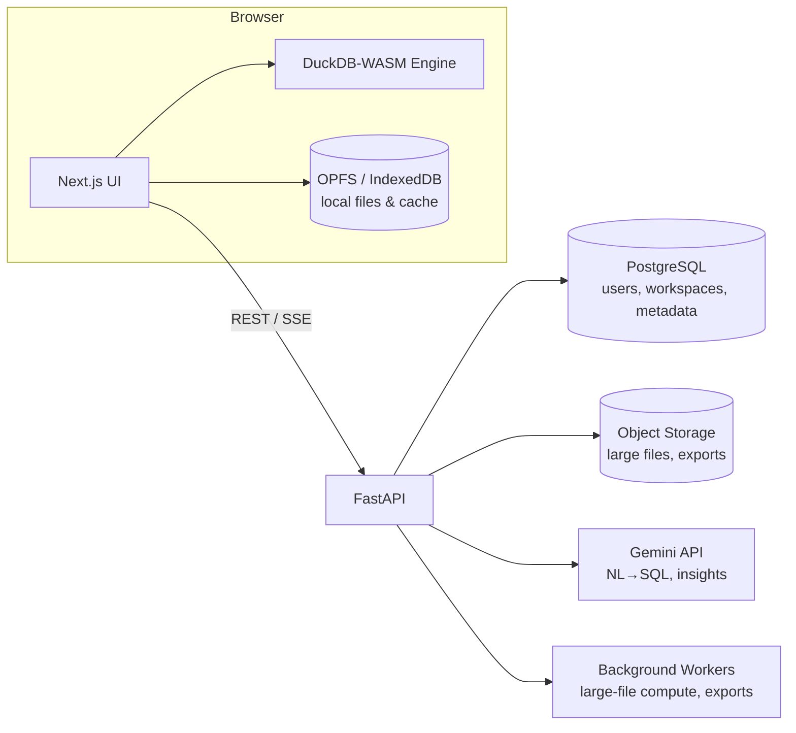

# In-Browser Data Workbench — Development Plan Overview

## Vision

A privacy-first data workbench that runs **in the browser**. Users drop in files (CSV, Excel, Parquet, JSON), and can immediately query them with SQL, clean/transform them, and build charts — all executed locally via **DuckDB-WASM**, so raw data never has to leave the machine. A **FastAPI** backend provides accounts, saved workspaces, sharing, and a server-side compute fallback for files too large for the browser. An **AI layer** turns natural language into SQL, profiles data, suggests cleaning steps, and generates insights.

## Tech Stack

| Layer | Technology |
|---|---|
| Frontend | Next.js 14+ (App Router), TypeScript, Tailwind CSS, shadcn/ui, DuckDB-WASM, Monaco Editor, TanStack Table/Virtual, ECharts (or Recharts), Zustand |
| Backend | FastAPI, Python 3.12, SQLAlchemy 2 + Alembic, PostgreSQL, Redis, S3-compatible object storage, Celery (or ARQ) for background jobs |
| AI | Google Gemini API via backend, schema-aware NL→SQL, data profiling, streaming responses |
| Infra | Docker Compose (dev), Vercel (frontend) + containerized FastAPI (Railway/Fly/AWS), GitHub Actions CI |

## High-Level Architecture



**Key principle:** the browser is the primary compute engine. The backend stores *metadata and artifacts* (workspace definitions, saved queries, chart configs), not raw data — unless the user explicitly opts into cloud storage or server-side compute for large files.

## Plan Structure

```
plan/
├── overview.md          ← this file
├── frontend/
│   ├── phase1.md        Foundation: app shell, file ingestion, DuckDB-WASM, data preview
│   ├── phase2.md        Core workbench: SQL editor, schema explorer, transformations
│   ├── phase3.md        Visualization: charts, dashboards, exports
│   └── phase4.md        AI UI, accounts, saved workspaces, polish
├── backend/
│   ├── phase1.md        Foundation: FastAPI skeleton, auth, database, Docker
│   ├── phase2.md        Persistence: workspaces, saved queries, files, sharing
│   └── phase3.md        Scale: server-side compute, jobs, observability, deployment
└── ai/
    ├── phase1.md        NL→SQL engine
    ├── phase2.md        Profiling, cleaning suggestions, auto-insights
    └── phase3.md        Conversational data analyst (agentic chat)
```

## Phase Sequencing & Dependencies

```mermaid
gantt
    dateFormat  X
    axisFormat  %s
    section Frontend
    FE Phase 1 (Foundation)        :fe1, 0, 3
    FE Phase 2 (Workbench)         :fe2, after fe1, 3
    FE Phase 3 (Visualization)     :fe3, after fe2, 3
    FE Phase 4 (AI UI + Accounts)  :fe4, after fe3, 3
    section Backend
    BE Phase 1 (Foundation)        :be1, 0, 3
    BE Phase 2 (Persistence)       :be2, after be1, 3
    BE Phase 3 (Scale)             :be3, after be2, 4
    section AI
    AI Phase 1 (NL→SQL)            :ai1, after be1, 3
    AI Phase 2 (Insights)          :ai2, after ai1, 3
    AI Phase 3 (Analyst Chat)      :ai3, after ai2, 3
```



Dependency notes:

- **FE Phase 1** and **BE Phase 1** start in parallel — the frontend is fully usable offline/anonymous before the backend exists.
- **AI Phase 1** needs BE Phase 1 (the AI endpoints live behind FastAPI so the API key stays server-side).
- **FE Phase 4** needs BE Phase 2 (accounts/workspaces) and AI Phase 1 (NL→SQL endpoint).
- **BE Phase 3** and **AI Phase 3** are the last mile toward production.

## Milestones

| Milestone | What ships | Requires |
|---|---|---|
| **M1 — Local Workbench (MVP)** | Drop a file, run SQL, see results — no account needed | FE 1–2 |
| **M2 — Visual Workbench** | Charts and dashboards on local data | FE 3 |
| **M3 — Connected Workbench** | Accounts, saved workspaces, sharing, "Ask AI" for SQL | FE 4, BE 1–2, AI 1 |
| **M4 — Intelligent Workbench** | Auto-profiling, insights, conversational analyst, big-file server compute | BE 3, AI 2–3 |

## Cross-Cutting Conventions

- **Monorepo layout:** `apps/web` (Next.js), `apps/api` (FastAPI), `packages/shared` (shared types/OpenAPI-generated client).
- **API contract-first:** FastAPI's OpenAPI schema is the source of truth; the frontend client is generated from it.
- **Every phase ends with:** passing CI (lint + typecheck + tests), a demoable feature, and its docs updated.
- **Privacy stance documented everywhere:** local-first by default; anything leaving the browser is explicit and visible to the user.
